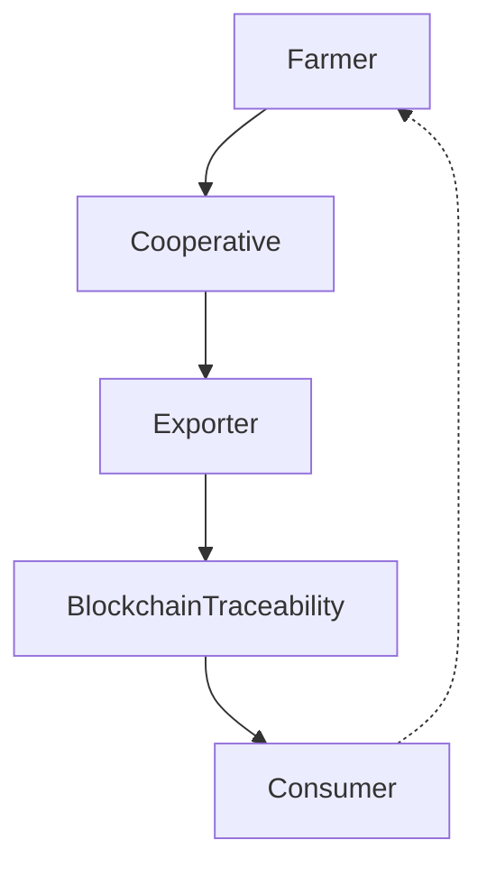

## 🧜‍♀️ Mermaind

Mind your flow, let Mermaind draw it for you.

Mermaind adalah tool untuk membantu akademisi, peneliti, dan praktisi membuat flow diagram hanya dengan prompt singkat.
Nama Mermaind adalah gabungan dari Mermaid dan Mind → cukup tulis deskripsi alur, biarkan Mermaind menggambarkannya untukmu.

---

## 🚀 Alur Kerja

- Prompt → Tulis deskripsi singkat flow (node + relasi + kondisi).

- Mermaid Code → LLM menghasilkan kode otomatis (Mermaid atau Graphviz DOT).

- SVG Render → Diagram langsung dihasilkan dalam format vector (SVG).

- Polish → Tambahkan warna, ikon, style sesuai kebutuhan.

- Final Q1 Diagram → Diagram tajam siap masuk ke paper Q1.

---

## ✨ Fitur Utama

- Auto-generate code → Mermaid/Graphviz DOT dari prompt/JSON.

- Langsung visual → Output SVG/PNG siap dipakai di paper, laporan, presentasi.

- Vector first → Semua diagram diekspor sebagai SVG (tajam di print, scalable).

- Legend kecil → Tiap diagram otomatis punya legend mini agar lebih informatif.

- Flexible polish → Bisa di-tweak lagi di Figma, Inkscape, Illustrator, atau PowerPoint.

---

## 🎯 Positioning

Mermaind hadir sebagai asisten visual akademisi.
Cepat, jelas, rapi, tanpa ribet bikin node & panah manual.

🔥 Dengan Mermaind, kamu ga perlu lagi pusing gambar manual → cukup fokus di ide, biar tool yang gambar alurnya.

---

## 🛠️ Contoh Penggunaan
Prompt

```bash
“Gambarkan supply chain AgroViz. Dari petani → koperasi → eksportir → blockchain traceability → konsumen. Tambahkan feedback loop dari konsumen balik ke petani.”
```

Output (Mermaid code)


Hasil Diagram

→ SVG tajam siap di-embed ke jurnal/paper Q1.

---

## 📦 Integrasi

- Bisa dipakai langsung di Mermaid Live Editor atau CLI.

- Output SVG bisa dimodifikasi di Figma/Inkscape/Illustrator.

- Cocok untuk laporan akademik, visualisasi sistem, hingga proposal riset.

---

## 📌 Roadmap

- Dukungan Graphviz penuh (DOT → SVG).

- Opsi auto-style (warna tema: akademik, bisnis, dark).

- Ekspor langsung ke LaTeX/TikZ.

- Template diagram standar (workflow, supply chain, blockchain).

---

## License
MIT © 2025 RANTAI / ELPEEF
