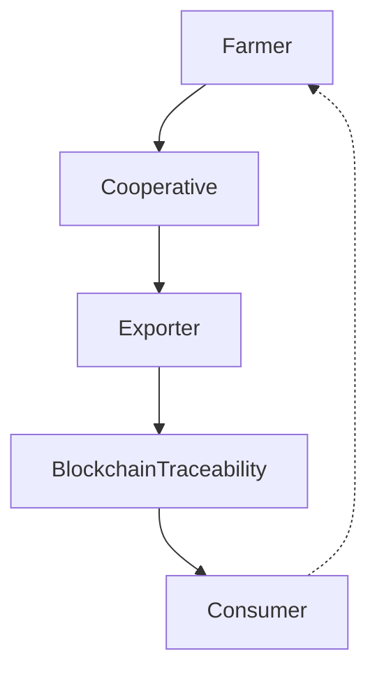

## 🧜‍♀️ Mermaind - AI-Powered Academic Diagram Generator

Mermaid + MindMap. Mind your flow, let Mermaind draw it for you.

Mermaind adalah tool untuk membantu akademisi, peneliti, dan praktisi membuat flow diagram hanya dengan prompt singkat.
Nama Mermaind adalah gabungan dari Mermaid dan Mind → cukup tulis deskripsi alur, biarkan Mermaind menggambarkannya untukmu.

[](https://nextjs.org/)
[](https://www.typescriptlang.org/)
[](https://tailwindcss.com/)
[](https://base.org/)

> Transform natural language into publication-ready academic diagrams in seconds. Powered by AI, designed for researchers.

[Live Demo](https://mermaind.elpeef.com) • [API Docs](./API.md) • [Contributing](./CONTRIBUTING.md) • [Changelog](./CHANGELOG.md)

---

## 🌟 **Overview**

**Mermaind** is an advanced academic diagram generator that combines the power of AI with the precision of Mermaid.js to create publication-ready flow diagrams from natural language prompts. Built specifically for researchers, academics, and students who need professional diagrams for papers, theses, and presentations.

### **Why Mermaind?**

- 🤖 **AI-Powered**: Perplexity AI understands your research context and generates accurate diagrams
- 📚 **Academic-Focused**: 200+ templates for research workflows, methodologies, and protocols
- 📝 **Publication-Ready**: Export to SVG, PDF, LaTeX with proper citations and formatting
- 🔗 **LaTeX Integration**: One-click export to Overleaf with complete project scaffolding
- 📖 **Reference Managers**: Direct export to Zotero, Mendeley, EndNote
- 💬 **Collaboration**: Real-time commenting with @mentions and threaded discussions
- 🎨 **Beautiful UI**: Clean, modern interface with light/dark mode and web3 aesthetic
- 🔌 **REST API**: Programmatic access for automation and integration

---

## 🎯 **Features**

### **Core Functionality**

#### **1. AI-Enhanced Diagram Generation**
- **Natural Language Input**: Describe your process in plain English
- **Context-Aware**: Upload research papers for informed diagram creation
- **Smart Templates**: 200+ academic templates across all disciplines
- **6 Diagram Types**: Flowchart, Sequence, Class, State, Gantt, Git Graph

#### **2. Academic Integration**

**Citation Generator**
- IEEE, APA, MLA, Chicago formats
- Auto-generated BibTeX entries
- Publication-ready references

**Reference Manager Export**
- Zotero RDF format
- Mendeley BibTeX
- EndNote XML
- One-click metadata export

**Overleaf Integration**
- Complete LaTeX project generation
- Quick snippets for existing documents
- Multiple document classes (article, thesis, report, beamer)
- Professional figure formatting

#### **3. Collaboration Features**

**Commenting System**
- @mention collaborators
- Threaded discussions
- Reaction system (like, agree, question, important)
- Resolution tracking
- Edit and delete capabilities

**Version Control**
- Git-like branching
- Commit history
- Change tracking
- Version comparison

#### **4. Export Options**
- **Vector Graphics**: SVG, PDF
- **High Resolution**: PNG (300+ DPI)
- **LaTeX**: Complete projects or snippets
- **Multiple Formats**: Simultaneous multi-format export

#### **5. REST API**
- Programmatic diagram generation
- 200+ template access
- API key management
- Usage analytics
- Rate limiting (100 req/hour)

---

## 🛠️ Contoh Penggunaan
Prompt

```bash
“Gambarkan supply chain AgroViz. Dari petani → koperasi → eksportir → blockchain traceability → konsumen. Tambahkan feedback loop dari konsumen balik ke petani.”
```

Output (Mermaid code)


---

## 🧰 **Tech Stack**

### **Frontend**
- **Framework**: Next.js 14 (App Router)
- **Language**: TypeScript
- **Styling**: Tailwind CSS
- **UI Components**: Radix UI
- **Diagram Engine**: Mermaid.js
- **State Management**: React Hooks

### **Backend**
- **API**: Next.js API Routes (Edge Runtime)
- **AI Integration**: Perplexity API
- **Storage**: LocalStorage (offline-first)
- **Export**: html2canvas, jsPDF

### **Infrastructure**
- **Deployment**: Vercel
- **Blockchain**: Base (web3 integration ready)
- **API**: RESTful with OpenAPI spec

---

## 🚀 **Getting Started**

### **Prerequisites**
- Node.js 18+ 
- npm or yarn
- Perplexity API key (optional, for AI features)

### **Installation**

```bash
# Clone the repository
git clone https://github.com/yourusername/mermaind.git
cd mermaind

# Install dependencies
npm install

# Set up environment variables (optional)
cp .env.example .env.local
# Add your Perplexity API key to .env.local

# Run development server
npm run dev
```

Open [http://localhost:3000](http://localhost:3000) to see the app.

### **Environment Variables**

```env
# Optional: AI Enhancement
PERPLEXITY_API_KEY=your_api_key_here

# Optional: Analytics
NEXT_PUBLIC_ANALYTICS_ID=your_analytics_id
```

---

## 📖 **Usage Guide**

### **Basic Usage**

1. **Enter Your Prompt**
   ```
   Example: "Show the peer review process for submitting 
   to a Q1 journal with editor decision, reviewer feedback, 
   and revision cycles"
   ```

2. **Select Diagram Type**
   - Flowchart: Processes and workflows
   - Sequence: Interactions and communications
   - Class: System architecture and relationships
   - State: Lifecycle and transitions
   - Gantt: Project timelines
   - Git Graph: Version control flows

3. **Generate Diagram**
   - AI analyzes your prompt
   - Generates structured Mermaid syntax
   - Renders publication-ready diagram

4. **Export & Share**
   - Download SVG/PNG/PDF
   - Export to Overleaf
   - Generate citations
   - Add to reference manager

### **Advanced Features**

#### **Context-Aware Generation**
```
1. Click "Context Analysis" button
2. Upload your research paper (PDF/DOCX)
3. AI reads and understands your research
4. Generates contextually accurate diagrams
```

#### **LaTeX/Overleaf Export**
```
1. Generate your diagram
2. Click "Overleaf" button
3. Choose export type:
   - Quick Snippet: Copy-paste code
   - Full Project: Complete LaTeX package
4. Upload to Overleaf and compile
```

#### **Team Collaboration**
```
1. Generate diagram
2. Click "Comments" button
3. Add comments with @mentions
4. Team members reply and react
5. Mark discussions as resolved
```

#### **API Usage**
```bash
# Generate diagram via API
curl -X POST https://mermaind.app/api/v1/diagram \
  -H "Authorization: Bearer YOUR_API_KEY" \
  -H "Content-Type: application/json" \
  -d '{
    "prompt": "Show machine learning pipeline",
    "type": "flowchart"
  }'
```

See [API.md](./API.md) for complete API documentation.

---

## 🎓 **Use Cases**

### **For PhD Students**
- Methodology flowcharts for thesis
- Research workflow diagrams
- Literature review structures
- Experimental protocols

### **For Research Teams**
- Collaborative workflow design
- Project timelines (Gantt)
- System architecture (Class diagrams)
- Communication flows (Sequence)

### **For Conference Presentations**
- Beamer presentation integration
- Professional diagram styling
- High-resolution exports
- Quick iteration cycles

### **For Journal Submissions**
- Publication-ready figures
- Q1 journal compliance
- Proper citations
- Multiple format support

---

## 📚 **Documentation**

- [API Documentation](./API.md) - Complete REST API reference
- [Contributing Guide](./CONTRIBUTING.md) - How to contribute
- [Architecture](./ARCHITECTURE.md) - Technical architecture overview
- [Changelog](./CHANGELOG.md) - Version history and updates

---

## 🤝 **Contributing**

We welcome contributions! Please see [CONTRIBUTING.md](./CONTRIBUTING.md) for details.

### **Quick Start for Contributors**

```bash
# Fork and clone
git clone https://github.com/yourusername/mermaind.git

# Create feature branch
git checkout -b feature/amazing-feature

# Make changes and test
npm run dev
npm run build

# Commit and push
git commit -m "Add amazing feature"
git push origin feature/amazing-feature

# Open Pull Request
```

---

## 🗺️ **Roadmap**

### **Q1 2024** ✅
- [x] Core diagram generation
- [x] AI integration (Perplexity)
- [x] 200+ academic templates
- [x] Export system (SVG, PNG, PDF)
- [x] Citation generator
- [x] Reference manager integration
- [x] Overleaf integration
- [x] Commenting system
- [x] REST API

### **Q2 2024** 🚧
- [ ] Real backend with database (Supabase)
- [ ] User authentication and accounts
- [ ] Real-time collaboration (WebSocket)
- [ ] Mobile apps (iOS/Android)
- [ ] Template marketplace
- [ ] Advanced analytics

### **Q3 2024** 📋
- [ ] Blockchain verification (Base)
- [ ] Institution SSO integration
- [ ] Google Docs/Word plugins
- [ ] Enhanced AI models
- [ ] Custom shape libraries
- [ ] Preprint server integration

### **Q4 2024** 🔮
- [ ] Enterprise features
- [ ] Academic social network
- [ ] Advanced collaboration tools
- [ ] AR/VR diagram exports
- [ ] Interactive diagrams
- [ ] Multi-language support

---

## 🏆 **Recognition**

Built with ❤️ on [Base](https://base.org/) blockchain infrastructure.

### **Credits**
- **Icons**: [github.com/mrbrightsides](https://github.com/mrbrightsides)
- **Design Inspiration**: [rantai.elpeef.com](https://rantai.elpeef.com)
- **Diagram Engine**: [Mermaid.js](https://mermaid.js.org/)
- **AI Provider**: [Perplexity AI](https://perplexity.ai/)

---

## 📄 **License**

MIT License - see [LICENSE](./LICENSE) file for details.

---

## 💬 **Community & Support**

- **Issues**: [GitHub Issues](https://github.com/mrbrightsides/mermaind/issues)
- **Discussions**: [GitHub Discussions](https://github.com/mrbrightsides/mermaind/discussions)
- **Email**: support@elpeef.com

---

## 🌟 **Star History**

If you find Mermaind useful, please consider giving it a star! ⭐

[](https://star-history.com/#mrbrightsides/mermaind&Date)

---

## 📊 **Stats**

- **200+** Academic Templates
- **6** Diagram Types
- **4** Citation Formats
- **3** Reference Manager Exports
- **100+** API Requests/Hour
- **0** Cost to Use (Free & Open Source)

---

**Built with 🔵 on Base • Empowering Academic Research Worldwide** 🚀

Made with ❤️ by researchers, for researchers.
